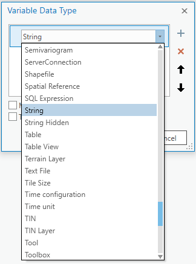
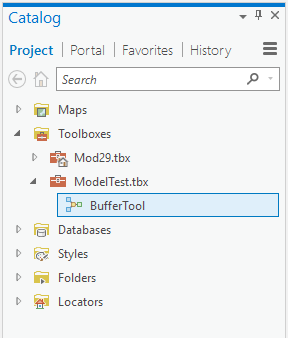
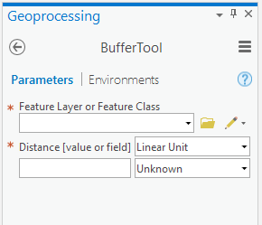

# TAMU GIS Programming
# Learning Objectives
- Describe Model Builder 
- Outline the basic model creation process
# Model Builder
**Model Builder** is a way to visually create a tool for use in ArcGIS. In much the same way you have been using words to create a tool to determine which buildings are near a particular building, you can achieve the same thing by dragging and dropping various little widgets around the screen. Pretty much all functionality and features of using the arcpy module are present when using Model Builder. You still have access to asking for user input, you can still create new layers, use geoprocessing tools, and so on. 
>
# Creating a new model
The first step to creating a new model is to create a new toolbox. When you right click on the newly created toolbox you will be given the chance to create a new tool. Here you can choose between either a script-based tool like we've done previously, or you can choose a **Model**. Go ahead and select **Model**.
>

>
Once you've created the default model, you will see a new toolbar at the top of your screen, the **ModelBuilder** toolbar. Here we have all the different widgets and operations important to model building such as adjusting the model components to fit the screen, model validation, and model component insertion. This toolbar will soon show its usefulness.
>

>
If we expand the **Insert** section, you will come across these six groups of components. These are the components that make up our models. We will be discussing just a few of these component groups. Each component seen here has a different shape when put onto the ModelBuilder's "canvas". If you click on the edge of a component while in the **Select** mode, you will be able to create a relationship between various components; this relationship is denoted by a thin black arrow.

>

>
The **Tools** components allow you to drag and drop a typical geoprocessing tool onto the ModelBuilder canvas. Tool components are shaped like ovals on the canvas. If the tool has an output, whenever you drag the tool onto the canvas it will also create a result variable shown as the oval component. This variable contains the output of the tool.
>

>
**Variable** components allow you to define inputs for various tools used in your model. These components are oval shaped. You can have two types of variables: parameters and non-parameters. A **parameter** variable is simply a variable that the user can define. These are those variables you see in tools that require you to input a layer or a value. A **parameter** variable is denoted by a large **P** in the corner of the component. A **non-parameter** variable is a variable that we define the value of within the ModelBuilder interface. Think of these as constants; values we assign and cannot be changed by the user.
>

>
Below we have re-created the buffer geoprocessing tool in model format. We have two parameter variables: a feature layer or class and the buffer distance. Each has a large **P** telling us that these are indeed parameters the user must supply. Notice how each variable has a thin black arrow that points to the buffer tool; this means that the buffer tool is the next operation to be triggered after the user has supplied the parameters. The tool uses the parameters in order to operate. The resulting layer that contains the buffered points is then stored inside the non-parameter variable **Output Feature Class**.
>

>
Below is a simplified model of our building proximity tool from previous lectures. Notice how it incorporates the buffer model we just discussed. We use the resulting "Output Feature Class" as an input into the clip geoprocessing tool. But in order to clip we need two parameters: the layer to be clipped and the clipping mask. We are going to use the buffer output as our clipping mask and we'll use a variable that contains our feature class Structures as the clipping layer. The result of our clip will be stored inside the "Output Feature Class (2)" variable.
>

>
When creating a new model, remember to use the "Save As..." option to save the tool else your changes may not be reflected in the Catalog or Geoprocessing panes. If you make changes to our tool and they do not seem to be reflected make sure you've been saving as you add to your model. Once your model has been saved, look inside the toolbox you created earlier. You should see a model with the name you provided; in this case the model is called **BufferTool**.
>

>
Double clicking on the BufferTool will open up our tool. It looks just like a tool created programmatically with Python and arcpy, but without any hands on programming. We can produce tools that do more or less the same as their arcpy counterparts, but without any programming knowledge.
>

>
Below is the result of using the centroids of the parking garages as the input to be buffered in our model.
>

>

# Exporting a model as Python for Editing/Enhancing

On of the best things that you used to be able to do with a Model in ArcMap, was to export it as Python so you could edit it to make it do exactly what you wanted, but had a really, really, **really** hard time figuring out how to wire up in Model Builder.

With the release of ArcGIS Pro, Esri has removed this functionality. You should [join the chorus of people asking for this to be added back in](https://community.esri.com/ideas/11384-add-export-model-to-python-script-back-to-arcgis-pro)

# Additional resources
- http://pro.arcgis.com/en/pro-app/help/analysis/geoprocessing/modelbuilder/what-is-modelbuilder-.htm
- -https://www.youtube.com/watch?v=ONt2OIQ55ig&t=51s
- https://www.youtube.com/watch?v=ONt2OIQ55ig&t=234s

## Videos
[Module7-Topic4](https://youtu.be/wEEgE8X1tnU)
